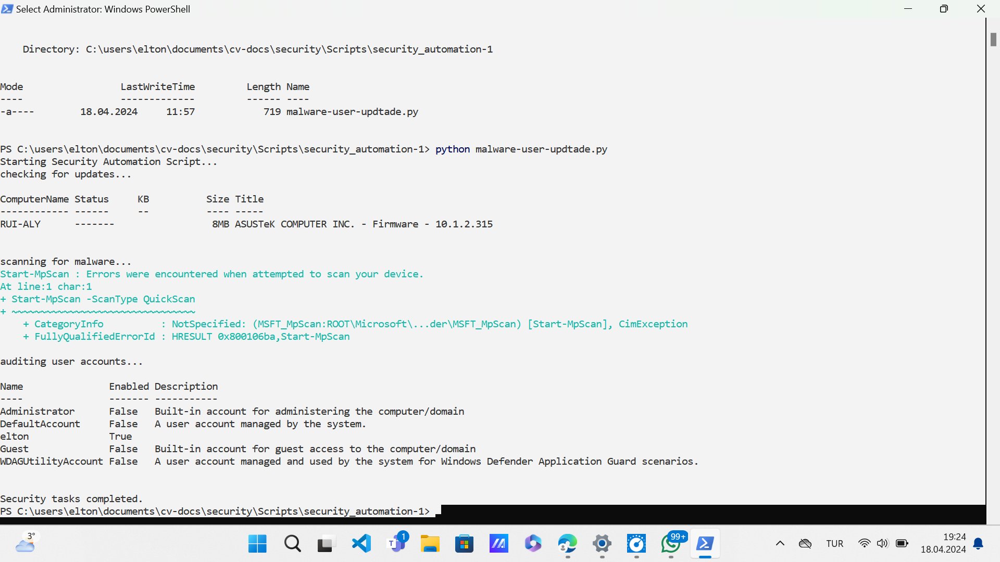

Description:
Thi Security Automation Script is a Python-based tool designed to enhance the security posture of Windows systems through automated tasks. This script streamlines essential security checks and processes, ensuring the system remains protected against potential threats.

Functionality:

Checking for Windows Updates: This function verifies the system's update status by querying Windows Update using PowerShell commands. It ensures that the latest security patches and enhancements are applied, minimizing vulnerabilities.
Scanning for Malware: The script initiates a quick scan using Windows Defender to detect and remove any malicious software present on the system. This proactive measure safeguards against various forms of malware, including viruses, spyware, and ransomware.
Auditing Local User Accounts: This function conducts an audit of local user accounts, providing insights into the users configured on the system. By examining user privileges and permissions, potential security risks associated with unauthorized access can be identified and addressed promptly.
Execution:
Upon execution, the script sequentially performs the aforementioned security tasks, providing real-time feedback on the actions being taken. Each task is initiated through PowerShell commands, ensuring compatibility and efficiency within the Windows environment.

